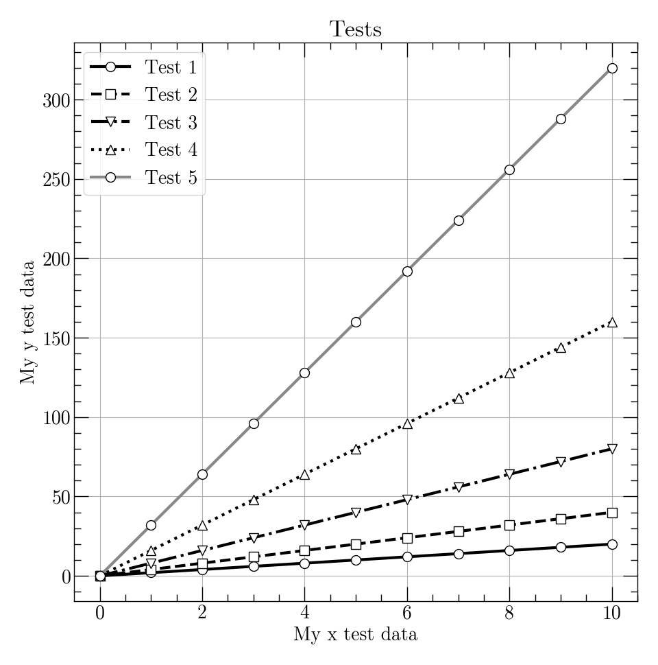

# PLOT
This repo contains my day to day plotting scripts and is susceptible to vary
from day to day.

## qp

My most useful script is `qp` (stands for *QuickPlot*) which
uses `numpy` and `matplotlib`. It is a quick and dirty script that acts as a
CLI script to plot data files. It started a long time ago and as time passes
and I get more and more knowledge of matplotlib and python, things change.
Some features might disappear and some are kind of fuzzy, experimental or not
compatible at all.

The core of the script is still that:
```
qp -i file.dat 1:2
```
will plot column 1 against column 2 of `file.dat`.

## Old.mplstyle

`Old.mplstyle` is a style file for matplotlib. It changes default parameters
like linewidth for both axes and curves, markers, fonts etc. The style is made
to give an "old school scientific paper" (hence the name) feel to the plots.
The idea is essentially that the figures can be understood printed in
grayscale (no "colors online" bullshit). Here is an example:



## Other scripts

Other scripts are very specific stuff and all. Non of then is to be released
used by anyone else yet. But you can give them a look if you want.
